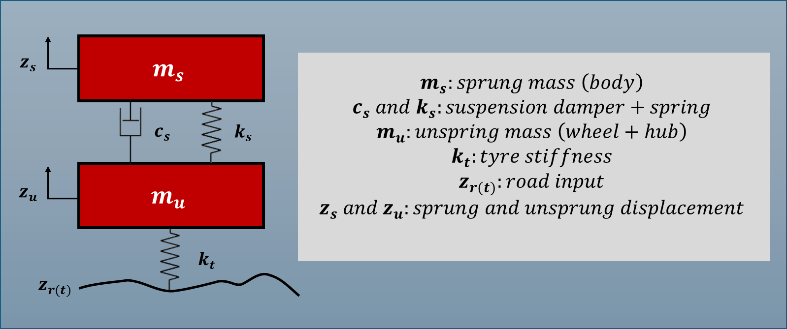
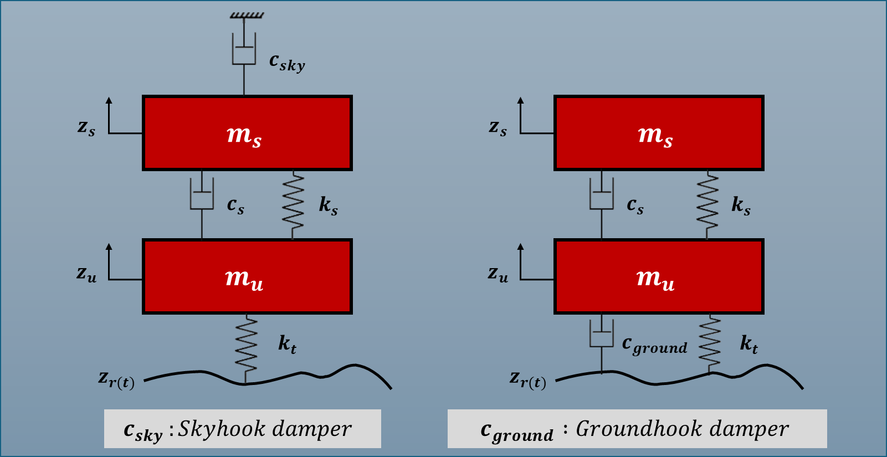
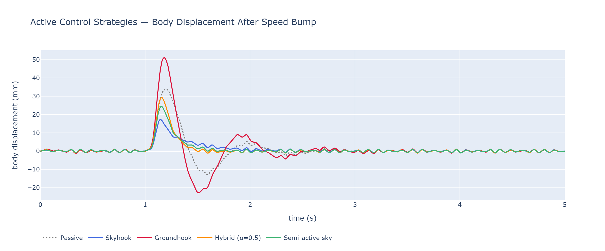
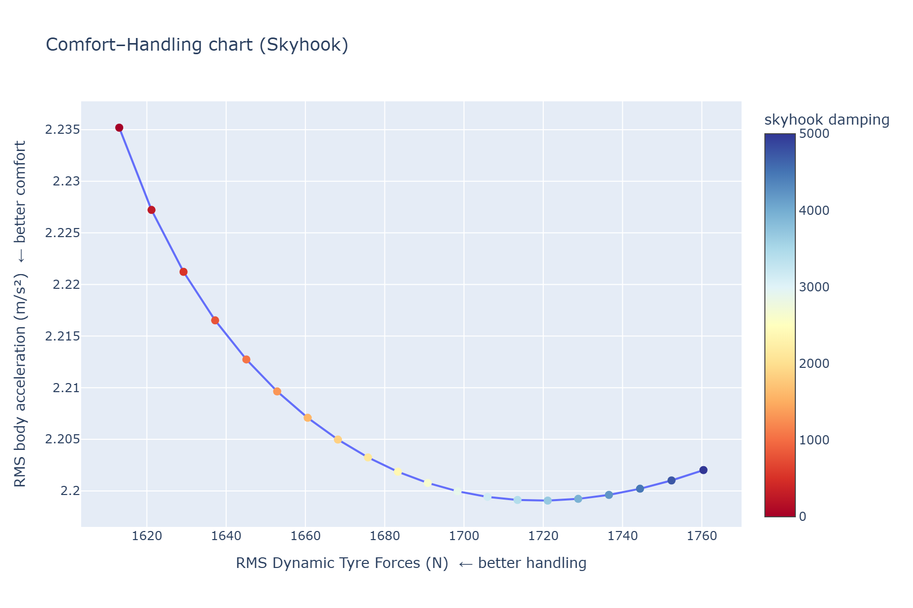
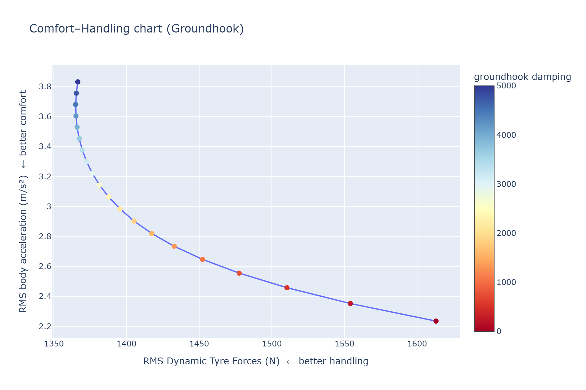
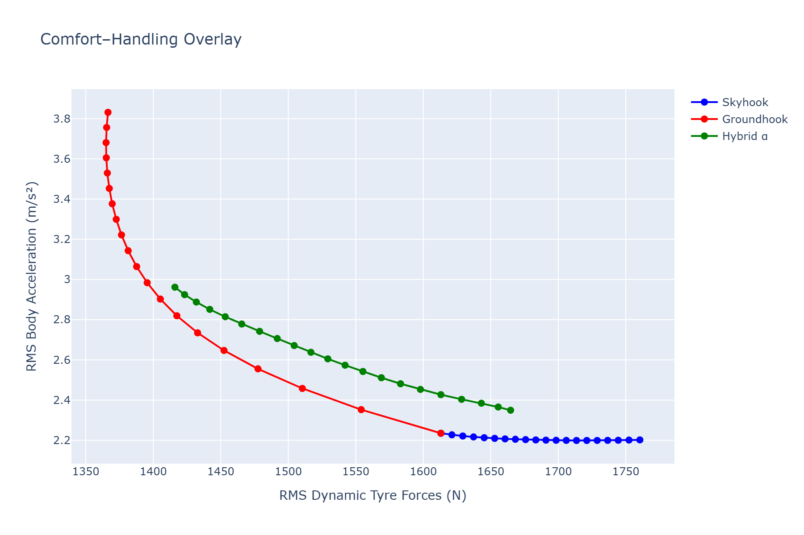
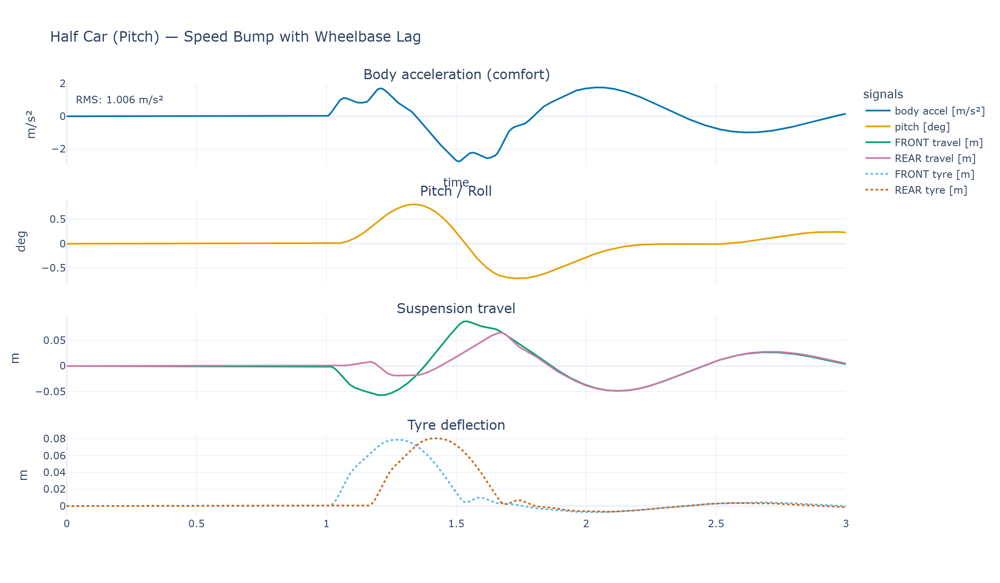
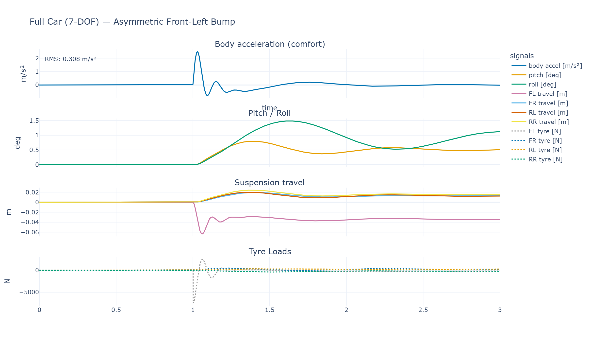

# Suspension Dynamics: From Quarter Car to Full Vehicle

*Physics-based vehicle modelling and ideal active control with SimWeave.*

Links to runnable notebooks, and a selection of plots found at the end of this article

## Table of Contents
1. [Introduction](#introduction)
2. [Why Bother Modelling Suspension?](#why-bother-modelling-suspension)
3. [A Note on Units](#a-note-on-units-first)
4. [The Quarter Car Model](#the-quarter-car-model)
    - [Comparing Damping Setups](#comparing-damping-setups)
5. [Half Car Models: Adding Pitch and Roll](#half-car-models-adding-pitch-and-roll)
6. [Full Car: Seven Degrees of Freedom](#full-car-seven-degrees-of-freedom)
7. [Ideal Controllers: Skyhook and Groundhook](#ideal-controllers-skyhook-and-groundhook)
    - [Skyhook](#skyhook)
    - [Groundhook](#groundhook)
    - [Using the Built-in Controllers](#using-the-built-in-controllers)
8. [SimWeave vs the Alternatives](#simweave-vs-the-alternatives)
9. [What's Next?](#whats-next)
10. [Try it out yourself](#try-it-out-yourself)

---

## Introduction

Every time your car hits a pothole, two things happen simultaneously: the wheel tries to follow the road surface up and over the obstacle, and the car body tries to stay still. The suspension system — spring, damper, and tyre — mediates between those two desires. Get the balance wrong and you either have a ride that hammers your spine (too stiff) or a car that wallows like a boat and loses tyre contact with the road (too soft).

Vehicle engineers spend enormous effort characterising this trade-off. The tools of choice are differential equation models of increasing complexity: quarter car, half car, and full car. This post walks through all three using SimWeave, shows how the library's `SIUnits` system catches dimensional errors before they reach your results, and finishes with the two theoretical ideal controllers — **Skyhook** and **Groundhook** — that give researchers a benchmark to aim for.

---

## Why Bother Modelling Suspension?

Before writing any code, it's worth being concrete about why this matters:

- **NVH engineering** (Noise, Vibration, Harshness): OEMs model hundreds of road-surface profiles and tune damper maps to hit ISO 2631 comfort targets.
- **ADAS and autonomous vehicles**: A model that predicts wheel-hop frequency informs when radar/camera measurements are most likely to be noisy.
- **Motorsport**: Quarter-car models are fast enough to run inside optimisation loops that sweep spring rates and anti-roll settings overnight.
- **EV platform design**: Battery-floor architectures shift the centre of gravity downward and change pitch/roll dynamics — fast iteration needs simulation.

Python has `scipy.integrate.solve_ivp` which works fine for one-off experiments, and MATLAB/Simulink is the industry gold standard (but expensive and closed). SimWeave sits between them: physics-first, units-aware, and open.

---

## A Note on Units First

Real suspension parameters span many orders of magnitude: tyre stiffness is ~200,000 N/m, sprung mass is ~300 kg, and the speed-bump height is measured in millimetres. Using raw floats is a recipe for factor-of-1000 mistakes.

SimWeave's `simweave.units` module tracks the seven SI base dimensions on every quantity. When you multiply or divide, the result is automatically re-typed to the appropriate concrete class:

```python
from simweave.units.si import Distance, TimeUnit, Velocity, Mass, Acceleration, Force
from simweave.units.constants import kg, m, s, g

# Literal expressions using constants
weight = 80 * kg * g           # -> Force [784.8 N]
energy = Mass(1.0) * (3e8*m/s)**2   # E = mc² (illustrative)

# Parsing units in the constructor — no manual conversion
t_drive  = TimeUnit(2.0, unit="mins")   # stored internally as 120.0 s
d_sprint = Distance(100.0, unit="ft")   # stored internally as 30.48 m

# Arithmetic propagates dimension and type automatically
v = Distance(120.0) / TimeUnit(2.0)     # Velocity [60.0 m/s]
a = v / TimeUnit(10.0)                  # Acceleration [6.0 m/s²]
f = Mass(1500.0) * a                    # Force [9000.0 N]

# Dimension mismatch is caught at runtime — not silently wrong
Distance(10.0) + TimeUnit(2.0)          # TypeError: incompatible dimensions
```

The models themselves use these types in `STATE_UNITS` to annotate what each state variable represents. After a simulation you can ask the model to *wrap* the raw NumPy output back into typed quantities:

```python
result = simulate(model, (0.0, 5.0), dt=0.001, inputs=road_input)
typed = model.wrap_states(result)    # dict[str, SIUnit]

print(typed["z_s"].max())       # Distance — peak body displacement
print(typed["z_s_dot"].max())   # Velocity — peak body velocity
```

This is especially useful when feeding suspension outputs into downstream calculations (e.g. computing dynamic tyre loads as a `Force`) because the type checker will refuse to add a `Velocity` to a `Mass`.

---

## The Quarter Car Model

The simplest useful suspension model treats one corner of the vehicle in isolation: a **sprung mass** (a quarter of the car body, ~250–300 kg) sitting on a **suspension spring and damper**, itself resting on an **unsprung mass** (wheel, hub, brake assembly, ~40–50 kg), which contacts the road through the **tyre spring** (very stiff, ~200,000 N/m).

<figure markdown>
  { width=640 }
</figure>

The equations of motion are:

$$m_s \ddot{z}_s = -k_s(z_s - z_u) - c_s(\dot{z}_s - \dot{z}_u)$$

$$m_u \ddot{z}_u = k_s(z_s - z_u) + c_s(\dot{z}_s - \dot{z}_u) - k_t(z_u - z_r)$$

The state vector is `[z_s, ż_s, z_u, ż_u]` — body and wheel position and velocity. The road profile `z_r(t)` enters as an external input.

```python
from simweave.continuous.solver import simulate
from simweave.continuous.systems import QuarterCarModel
import numpy as np

def road_bump(t: float) -> float:
    """A 10 cm speed bump traversed over 0.6 seconds."""
    t0, duration, height = 1.0, 0.6, 0.10
    if t < t0 or t > t0 + duration:
        return 0.0
    return height * np.sin(np.pi * (t - t0) / duration)

model = QuarterCarModel(
    sprung_mass=250.0,       # kg — body
    unsprung_mass=40.0,      # kg — wheel assembly
    suspension_stiffness=18_000.0,   # N/m
    damping=1_500.0,         # Ns/m
    tyre_stiffness=200_000.0,        # N/m
)

result = simulate(model, t_span=(0.0, 5.0), dt=0.001, method="rk4",
                  inputs=road_bump)
```

`simulate()` uses a fixed-step RK4 integrator (or Euler for speed-sensitive work). The result object carries `.time`, `.state`, and `.state_labels`.

### Comparing Damping Setups

The single most interesting quarter-car experiment is sweeping the damper rate `c_s`. Soft setups (low `c`) give better isolation over rough roads but allow the body to oscillate for longer. Stiff setups (high `c`) kill oscillation quickly but transmit more shock directly:

```python
for label, c in [("soft (800)", 800), ("stock (1500)", 1500), ("stiff (3500)", 3500)]:
    model = QuarterCarModel(250, 40, 18_000, c, 200_000)
    r = simulate(model, (0, 5), dt=0.001, inputs=road_bump)
    z_s_ddot = np.gradient(r.state[:, 1], r.time)
    rms = np.sqrt(np.mean(z_s_ddot**2))
    print(f"{label:20s}  RMS body accel = {rms:.3f} m/s²")
```

!!! tip "Visualising results"
    `simweave.viz.vehicle_dynamics.plot_vehicle_metrics` produces a multi-panel Plotly figure showing body displacement, velocity, wheel travel, tyre deflection, and (optionally) tyre force — all in a single call:

    ```python
    from simweave.viz.vehicle_dynamics import plot_vehicle_metrics
    fig = plot_vehicle_metrics(result, model=model)
    fig.show()
    ```

    The resulting figure makes the **comfort/handling trade-off visible at a glance**: the soft setup has a smaller initial spike but rings for longer; the stiff setup has a sharp transient but settles fast.

---

## Half Car Models: Adding Pitch and Roll

A quarter-car tells you about one corner. The half-car models extend this by coupling two corners — either front and rear (pitch dynamics) or left and right (roll dynamics).

**HalfCarModel (pitch)** adds the vehicle's pitch inertia. This matters when braking or accelerating — weight transfer shifts load between axles and the front/rear springs compress by different amounts.

**RollCarModel** captures the lateral equivalent: cornering loads the outer suspension while unloading the inner. Roll stiffness and roll centre height are tuned by motorsport engineers for handling balance.

```python
from simweave.continuous.systems import HalfCarModel

def road_pair(t):
    """Front wheel hits bump at t=1, rear follows at t=1.15 s (wheelbase/speed lag)."""
    bump = lambda t0: 0.08 * np.sin(np.pi * (t - t0) / 0.5) if t0 < t < t0 + 0.5 else 0.0
    return bump(1.0), bump(1.15)   # (front z_r, rear z_r)

model = HalfCarModel(
        sprung_mass=1200.0,         # total sprung mass (kg)
        pitch_inertia=2500.0,       # pitch moment of inertia (kg·m²)
        unsprung_mass_front=60.0,   # front unsprung mass (kg)
        unsprung_mass_rear=60.0,    # rear unsprung mass (kg)
        k_sf=20000.0,               # front suspension stiffness (N/m)
        k_sr=20000.0,               # rear suspension stiffness (N/m)
        c_sf=1500.0,                # front suspension damping (Ns/m)
        c_sr=1500.0,                # rear suspension damping (Ns/m)
        k_tf=150000.0,              # front tyre stiffness (N/m)
        k_tr=150000.0,              # rear tyre stiffness (N/m)
        a=1.2,                      # front to Centre of Gravity (m)
        b=1.6,                      # rear to Centre of Gravity (m)
    )
result = simulate(model, (0, 5), dt=0.001, inputs=road_pair)
```

The state vector expands to four degrees of freedom: front and rear body positions plus body pitch angle and pitch rate.

---

## Full Car: Seven Degrees of Freedom

The `FullCarModel` couples all four corners and tracks heave (vertical bounce), pitch (nose-up/down), roll (left/right lean), and lateral and longitudinal dynamics, plus the four unsprung masses. This is the model used when you need to study how a road surface asymmetry (e.g. a pothole on one side) feeds into combined pitch and roll.

```python
from simweave.continuous.systems import FullCarModel

model = FullCarModel(
        sprung_mass=1200,       # total sprung mass (kg)
        pitch_inertia=2500,     # pitch inertia (kg·m²)
        roll_inertia=2200,      # roll inertia (kg·m²)
        unsprung_mass=60,       # unsprung mass (kg)
        k_s=20000,              # suspension stiffness (N/m)
        c_s=1500,               # suspension damping (Ns/m)
        k_t=150000,             # tyre stiffness (N/m)
        a=1.2,                  # CG → front axle
        b=1.6,                  # CG → rear axle
        track_width=1.6         # width between wheels (m)
    )

def asymmetric_input(t):
    """Front-left pothole only — excites both pitch and roll."""
    fl = 0.05 if t > 1.0 else 0.0
    return (fl, 0.0, 0.0, 0.0)   # (FL, FR, RL, RR)

result = simulate(model, (0, 3), dt=0.001, inputs=asymmetric_input)

typed = model.wrap_states(result)
print("Peak heave :", typed["z_s"].max())    # Distance
print("Peak pitch :", typed["theta"].max())  # Angle
print("Peak roll  :", typed["phi"].max())    # Angle
```

The `wrap_states()` call here returns `Angle` quantities for pitch and roll — which means downstream calculations like computing tyre normal force will refuse to accept them where a `Distance` is expected. That's the units system doing its job.

---

## Ideal Controllers: Skyhook and Groundhook

Passive suspension is a fixed compromise between comfort and handling. **Active** and **semi-active** suspension systems use controllable dampers (electro-rheological fluid, electromagnetic actuators) to adapt in real time. But what's the theoretical best you could possibly do?

Two benchmark controllers answer that question:

<figure markdown>
  { width=640 }
</figure>

### Skyhook

Imagine attaching a damper between the car body and a **fixed point in the sky** — an inertial reference that doesn't move with the road. The control force would be:

$$F_{\text{sky}} = -c_{\text{sky}} \cdot \dot{z}_s$$

This maximally isolates the body from road disturbances because it damps relative to the inertial frame rather than the wheel. The ride is as smooth as physics allows.

The catch: no fixed point in the sky exists. But a controllable damper can *emulate* this by varying its damping coefficient every timestep based on the measured body velocity.

### Groundhook

The mirror image: a damper between the **wheel** and the ground:

$$F_{\text{gnd}} = +c_{\text{gnd}} \cdot \dot{z}_u$$

This maximises tyre-road contact by suppressing wheel hop. Handling and braking are as good as they can be. But body acceleration suffers — disturbances transmit more freely upward.

### Using the Built-in Controllers

SimWeave ships `SkyhookDamper`, `GroundhookDamper`, and `HybridActiveDamper` in `simweave.continuous.control`. All three plug directly into the `controller` parameter of `QuarterCarModel`, `HalfCarModel`, and `FullCarModel` — no subclassing required:

```python
from simweave.continuous.systems import QuarterCarModel
from simweave.continuous.control import (
    SkyhookDamper, GroundhookDamper, HybridActiveDamper, SemiActiveWrapper,
)

base_kwargs = dict(
    sprung_mass=250.0, unsprung_mass=40.0,
    suspension_stiffness=18_000.0, damping=1_500.0,
    tyre_stiffness=200_000.0,
)

passive    = QuarterCarModel(**base_kwargs)
skyhook    = QuarterCarModel(**base_kwargs, controller=SkyhookDamper(damping=3_000.0))
groundhook = QuarterCarModel(**base_kwargs, controller=GroundhookDamper(damping=3_000.0))
blended    = QuarterCarModel(**base_kwargs,
                              controller=HybridActiveDamper(c_sky=3_000.0,
                                                            c_ground=3_000.0,
                                                            alpha=0.5))
```

The `SemiActiveWrapper` enforces a dissipative constraint on any controller — ensuring the force direction never adds energy to the system, which is required for passively realisable (e.g. magnetorheological) dampers:

```python
# Semi-active skyhook — physically realisable with a controllable damper
semi_active = QuarterCarModel(**base_kwargs,
                               controller=SemiActiveWrapper(SkyhookDamper(3_000.0)))
```

Run all variants and compare comfort vs road-holding:

```python
configs = [
    ("Passive",     passive),
    ("Skyhook",     skyhook),
    ("Groundhook",  groundhook),
    ("Blended α=0.5", blended),
    ("Semi-active", semi_active),
]

print(f'{"Controller":20s}  {"RMS accel (m/s²)":>12s}  {"Peak tyre (mm)":>15s} {"RMS tyre load (N)":>18s}')
print('-' * 80)
for name, model in configs:
    r = simulate(model, (0, 5), dt=0.001, inputs=road_bump)
    z_s_ddot  = np.gradient(r.state[:, 1], r.time)
    tyre_def  = r.state[:, 2]
    tyre_force = K_T * r.state[:, 2]
    rms_acc = np.sqrt(np.mean(z_s_ddot**2))
    rms_tyre   = np.sqrt(np.mean(tyre_force**2))
    print(f'{name:20s}  {rms:>12.3f}  {peak:>15.1f} {rms_tyre:>18.1f}')
```

!!! example "What to expect"
    **Skyhook** will show the lowest RMS body acceleration — smoothest ride. But tyre deflection (and hence contact-force variation) will be *higher* than passive; the controller is sacrificing road holding for comfort.

    **Groundhook** will show the best tyre contact but the highest body acceleration — the car body follows road disturbances more directly.

    **Blended (`HybridActiveDamper`)** sits between them. `alpha=1.0` recovers pure skyhook; `alpha=0.0` recovers pure groundhook. Running a sweep across `alpha` from 0 to 1 produces the **comfort–handling Pareto front** — a standard design tool in automotive NVH work.

    The `SemiActiveWrapper` variant is important for practical applications: a real controllable damper can only dissipate energy, not add it. The wrapper clips any positive-work forces, which slightly degrades theoretical performance but keeps the model physically honest.

!!! note "How the controllers work under the hood"
    Each controller implements `force(body_velocity, wheel_velocity) -> float`. The vehicle model calls this at every integration step and adds the returned force to the sprung mass equation. This clean interface means you can implement your own custom controller (e.g. a look-ahead preview controller or an LQR) in a single method, and the rest of the pipeline — integration, `wrap_states()`, `plot_vehicle_metrics()` — works without modification.

---

## SimWeave vs the Alternatives

| Approach | Strength | Weakness |
|---|---|---|
| `scipy.integrate.solve_ivp` | Flexible, adaptive step | No units, no built-in models, no Monte Carlo |
| MATLAB/Simulink | Industry standard, Simscape library | Expensive, closed, no Python ecosystem |
| `python-control` | Linear systems, Bode/root locus | Continuous only, no events or discrete integration |
| **SimWeave** | Units-aware, built-in models, hybrid DES+ODE, Monte Carlo | Younger library, smaller community |

If you already have Simulink, there's no urgent reason to move quarter-car work. If you're building an open-source tool chain — for an academic project, a startup, or a software-defined vehicle platform — SimWeave lets you run suspension analysis, fleet maintenance scheduling, and traffic signal optimisation from one coherent library, in pure Python.

---

## What's Next

The suspension models shown here are all **passive** or **idealised active**. The next natural step is implementing a **PID-controlled active suspension** (SimWeave already ships a `PID` controller example in demo 20 for a thermal system — the same controller class works on a suspension force). Beyond that:

- Feed real road profiles from measured accelerometer data as inputs.
- Run **Monte Carlo** sweeps over road roughness to compute probabilistic ride quality distributions.
- Couple the suspension model to a **tyre friction model** for combined longitudinal–lateral dynamics.
- Inclusion of Yaw Inertia, Handling models and optional stiffness and damping for front and rear on FullCarModel independently

---

## Try it out yourself

The full code, with all imports and visualisation helpers, is in the [companion notebook](https://github.com/Notabot123/simweave-notebooks).

### Selection of Visuals from this Blog

<figure markdown>
  { width=640 }
</figure>
*Comparative response of passive and controller based, quarter car models.*

<figure markdown>
  { width=640 }
</figure>
*A parameter sweep of Skyhook Damping coefficient.*
*Note that increasing Skyhook broadly improves ride comfort, at the expense of handling.*

<figure markdown>
  { width=640 }
</figure>
*A parameter sweep of Skyhook Damping coefficient.*
*Note that increasing Groundhook broadly improves handling, at the expense of ride comfort.*

<figure markdown>
  { width=640 }
</figure>
*A parameter sweep of Skyhook, Groundhook and Hybrid blends.*

<figure markdown>
  { width=640 }
</figure>
*A half car suspension model, with pitch shown.*

<figure markdown>
  { width=640 }
</figure>
*A 7 DOF full car model, with pitch and roll.*
